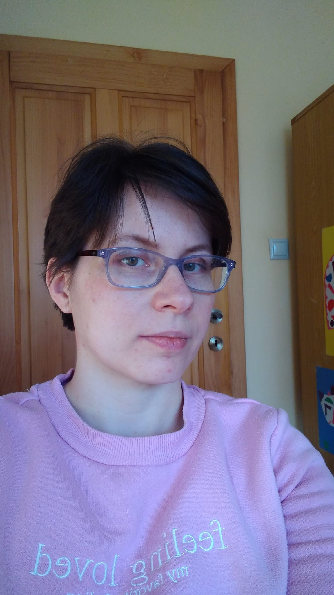

::: {.grid}

::: {.g-col-3}
{width=100%}
:::

::: {.g-col-8}

I am a data analytics graduate passionate about turning data into useful insights. I work with Python, SQL, machine learning, and visualization, and I enjoy building practical projects that solve real problems.

Email: l.macakova.sk@gmail.com

:::

:::
